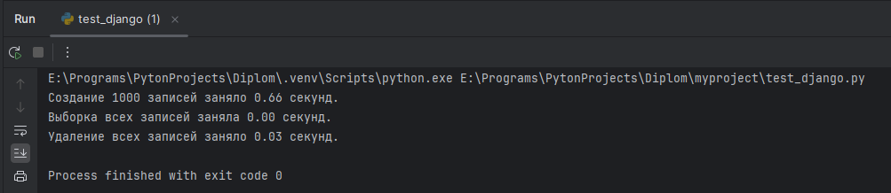
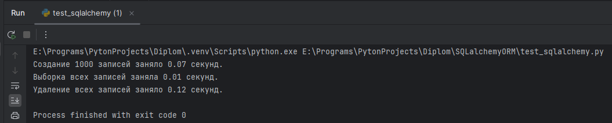

Данный проект представляет собой веб-приложение, разработанное для сравнения производительности и удобства использования различных библиотек ORM (Object-Relational Mapping): Django ORM, SQLAlchemy и Tortoise ORM. Приложение позволяет пользователям взаимодействовать с базой данных через веб-интерфейс, предоставляя возможность создания, редактирования, удаления и просмотра постов блога.

Функциональность
Основные функции:
Создание постов: Пользователи могут добавлять новые посты с заголовком и содержимым.
Редактирование постов: Пользователи могут изменять существующие посты.
Удаление постов: Пользователи могут удалять свои посты.
Просмотр списка постов: Все посты отображаются на главной странице, с возможностью просмотра каждого поста в отдельности.
Пагинация: Длинные списки постов разбиваются на страницы для удобства навигации.
Фильтрация: Пользователи могут фильтровать посты по различным критериям (например, по дате публикации или заголовку).

Дополнительные функции:
Аутентификация пользователей: Пользователи могут регистрироваться и входить в систему для управления своими постами.
Комментарии: Возможность оставлять комментарии к постам.
Поиск: Функция поиска по заголовкам и содержимому постов.

Технологии
Django: Основной фреймворк для разработки веб-приложения.
SQLAlchemy: Альтернативная библиотека ORM для работы с базами данных.
Tortoise ORM: Асинхронная библиотека ORM для работы с базами данных.
PostgreSQL: Система управления базами данных для хранения данных приложения.

Результаты тестирования DjangoORM:

Результы тестирования SQLAlchemyORM:

Результаты тестирования TortoiseORM:
